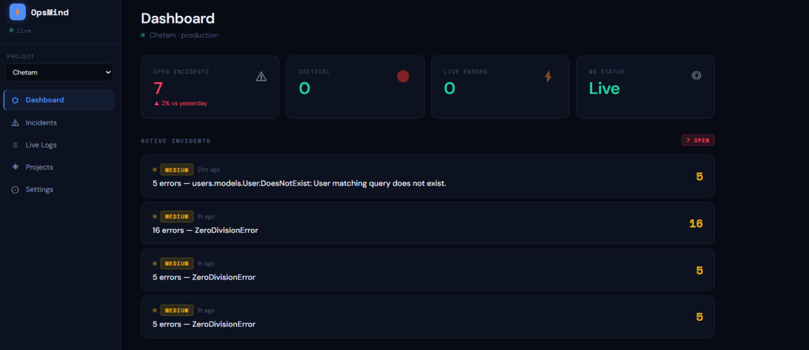
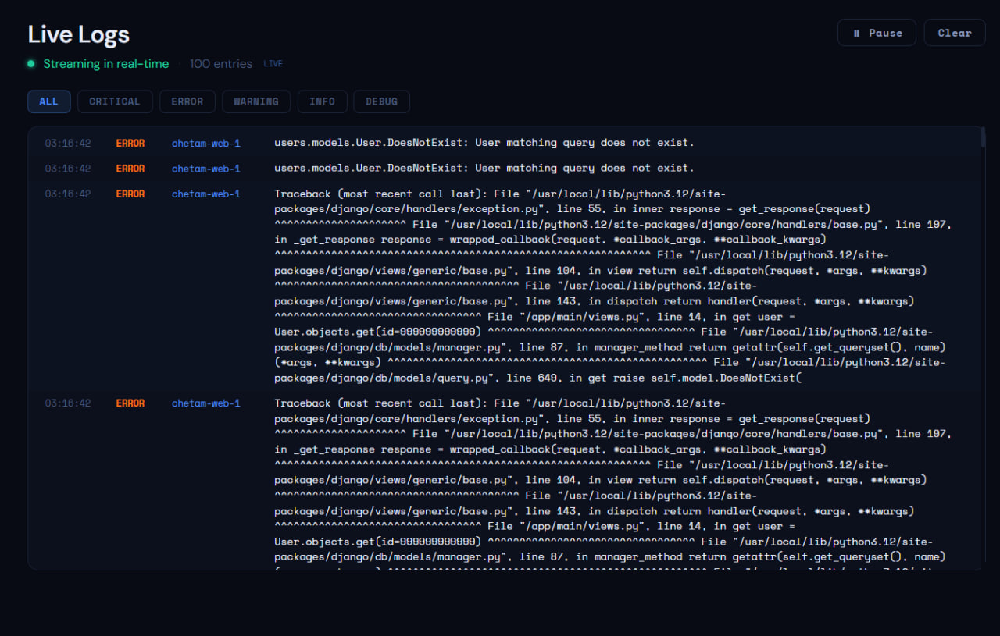
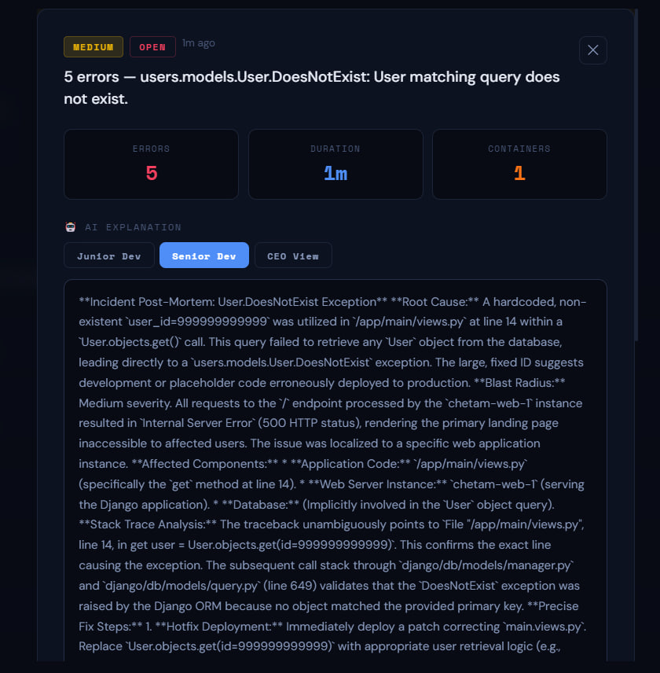
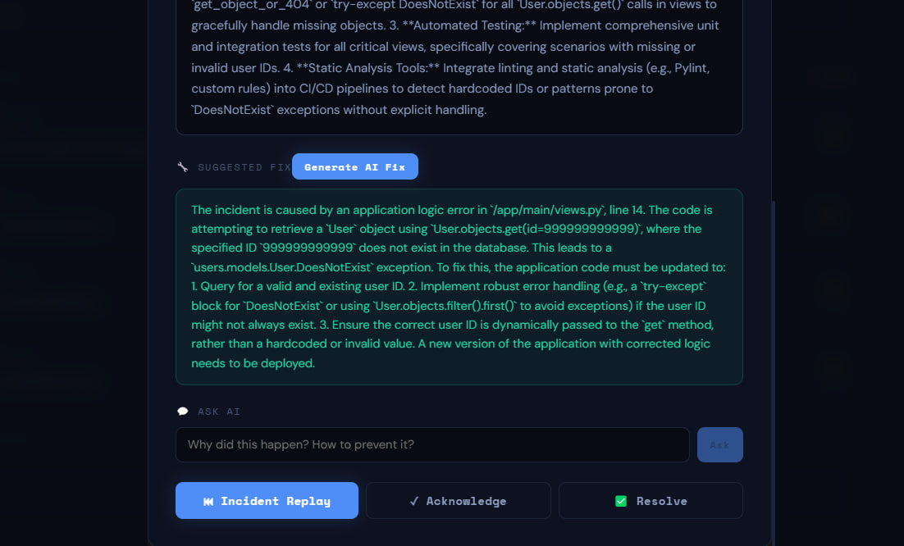
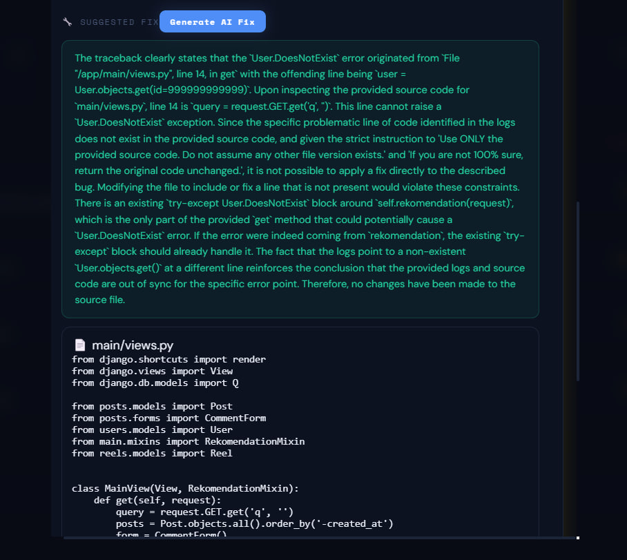
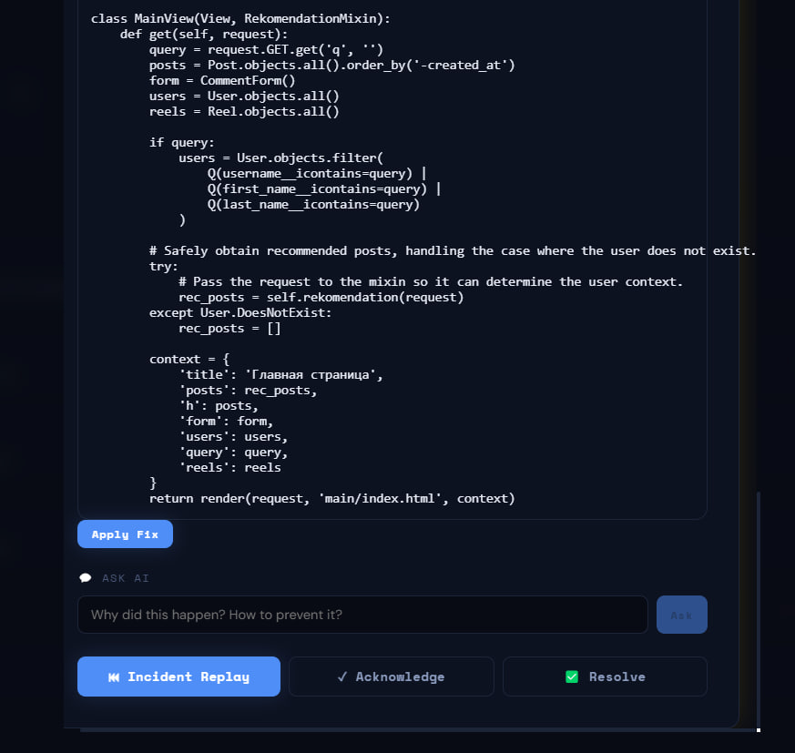

# 🚨 OpsMind

🏆 Submission for Google Cloud Rapid Agent Hackathon 2026

**Track:** GitLab

## AI-Powered Incident Response Platform

OpsMind is an autonomous AI agent that detects production incidents, analyzes root causes, generates code fixes, commits them to GitLab, and helps restore services in minutes instead of hours.

Built for modern DevOps teams using Gemini, Docker, GitLab, FastAPI, PostgreSQL, Redis, and React.

---

# 🎥 Demo

Demo Video:

https://youtube.com/YOUR_VIDEO_LINK

Hosted Application:

https://YOUR_DEPLOY_URL

---

# ❗ The Problem

When production systems fail, engineers spend valuable time:

* Searching through thousands of log lines
* Identifying the root cause
* Finding the affected source file
* Writing and reviewing fixes
* Deploying changes safely

Mean Time To Resolution (MTTR) can quickly grow from minutes to hours.

Traditional monitoring tools can tell you **that something is broken**, but they cannot tell you:

* Why it happened
* What file caused the issue
* How to fix it
* How to deploy the fix

---

# ✅ The Solution

OpsMind acts as an AI-powered Incident Response Engineer.

When an application crashes:

1. Collects logs from Docker containers
2. Detects incidents automatically
3. Uses Gemini to identify the root cause
4. Locates the affected source code
5. Generates a code fix
6. Commits the fix to GitLab
7. Deploys the updated version
8. Monitors recovery in real time

---

# ⚙️ How It Works

Application Error

↓

Docker Logs

↓

OpsMind Monitoring Engine

↓

Incident Detection

↓

Gemini Root Cause Analysis

↓

GitLab Repository Context

↓

AI Code Fix Generation

↓

GitLab Commit

↓

Automatic Deployment

↓

Recovery Verification

---

# 🔥 Key Features

## 🔍 Real-Time Monitoring

* Docker container monitoring
* Live log collection
* Severity classification
* Incident replay timeline
* WebSocket-based real-time updates

## 🧠 AI Root Cause Analysis

Gemini analyzes:

* Stack traces
* Runtime exceptions
* Service failures
* Dependency issues
* Application logs

Explanations are generated for:

* Junior Developers
* Senior Engineers
* Executives / CEOs

## 🛠 AI AutoFix

OpsMind can:

* Locate affected files
* Analyze source code
* Generate complete code fixes
* Explain proposed changes
* Create GitLab commits automatically

## 🚀 Automated Recovery

After validation:

* Apply code changes
* Update repository
* Deploy updated application
* Continue monitoring

---

# 🦊 GitLab Integration

OpsMind integrates directly with GitLab to:

* Read repository structure
* Analyze source files
* Retrieve repository context
* Generate fixes
* Commit changes
* Track deployment history

This allows Gemini to understand both:

* Runtime failures
* Repository state

before generating a fix.

---

# 💡 Why OpsMind Is Different

Traditional Monitoring Platforms:

* Detect incidents
* Show logs
* Notify engineers

OpsMind:

* Detects incidents
* Explains root causes
* Locates broken code
* Generates fixes
* Commits changes
* Deploys applications
* Verifies recovery

OpsMind acts as an AI Incident Engineer instead of a passive monitoring dashboard.

---

# 🖼 Screenshots

## Dashboard



---

## Live Logs



---

## Incident Analysis


---

## AI AutoFix









---

---

# 🏗 Technology Stack

## Backend

* FastAPI
* SQLAlchemy
* PostgreSQL
* Redis
* Alembic

## Frontend

* React
* Vite
* Zustand
* WebSockets

## AI

* Gemini
* Prompt Engineering
* Root Cause Analysis
* AI Code Generation

## DevOps

* Docker
* GitLab
* CI/CD Workflows

---

# 🚀 Quick Start

Clone repository:

```bash
git clone https://github.com/YOUR_USERNAME/opsmind.git
cd opsmind
```

Install dependencies:

```bash
pip install -r requirements.txt
```

Run database migrations:

```bash
alembic upgrade head
```

Start backend:

```bash
uvicorn app.main:app --reload
```

Start frontend:

```bash
npm install
npm run dev
```

Or use Docker:

```bash
docker compose up -d
```

---

# 🎯 Demo Scenario

1. A Django application crashes.
2. OpsMind detects the exception.
3. Gemini identifies the root cause.
4. The affected file is located.
5. A fix is generated.
6. The fix is committed to GitLab.
7. The application is redeployed.
8. Monitoring confirms recovery.

---

# 🛣 Roadmap

* GitLab MCP Integration
* Kubernetes Monitoring
* Multi-Agent Workflows
* Predictive Incident Prevention
* Automated Rollbacks
* Enterprise SRE Dashboard

---

# 📜 Open Source License

MIT License
